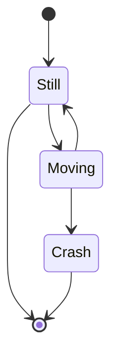

[GOTO: select-language](https://github.com/fRead-dev/info/tree/main/README.md)

---

# Українська

https://mermaid.live/edit#pako:eNptkMFOwzAMhl8l85VuZS10Ww9DSCAxrlx78RK3iZYmJU1AU9V3J9nggLScnN_fZ8megFtBUMNIn4EMpxeFncO-MSy-Z604Lff7u3crTc3eSGvLUp0xab8ZOmJnG55uwleMo0kIk4SO9fSLpt4yosuLEwerq52xw8W40FFb3MYPrCXSrHOEfgEZ9OR6VCJuMSWhAS-ppwbqWAp0pwYaM0cOg7cfZ8Oh9i5QBmEQ6P82_h--CuWtg7pFPcZQWxQUvxP485DO1anRx4ncmlZ1KQ9Ox1h6P4x1nqf2qlNehuOK2z4flZDovPzaVXlVVFssSqo2JT6WpeDH9W7bFg_rVmzu1wXCPM8_-_WDJQ

